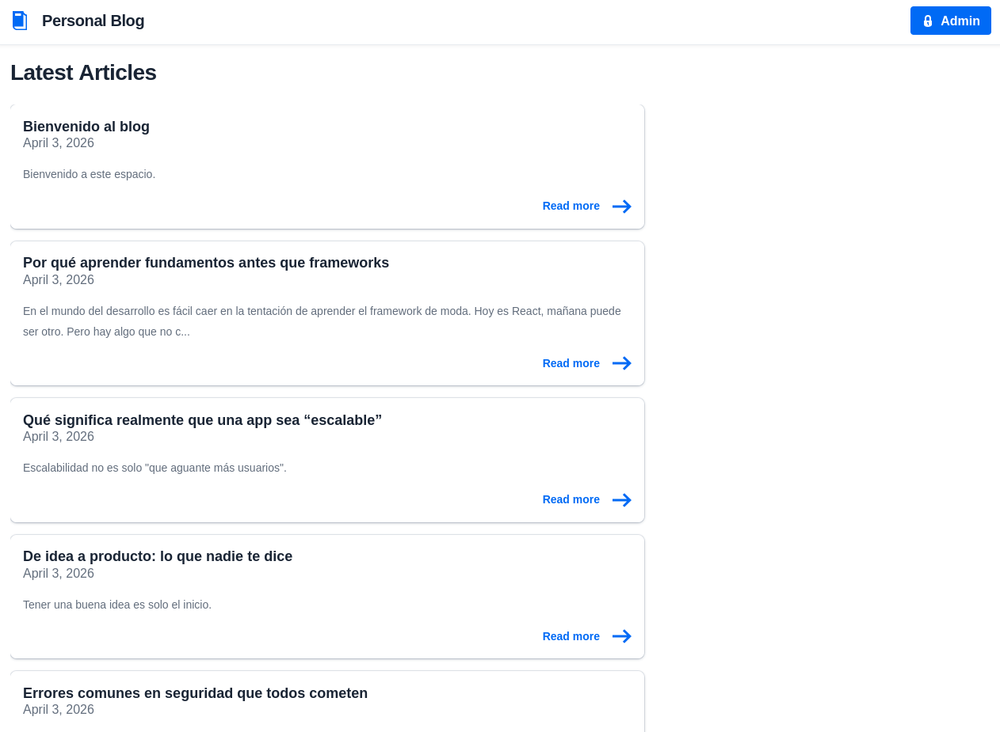
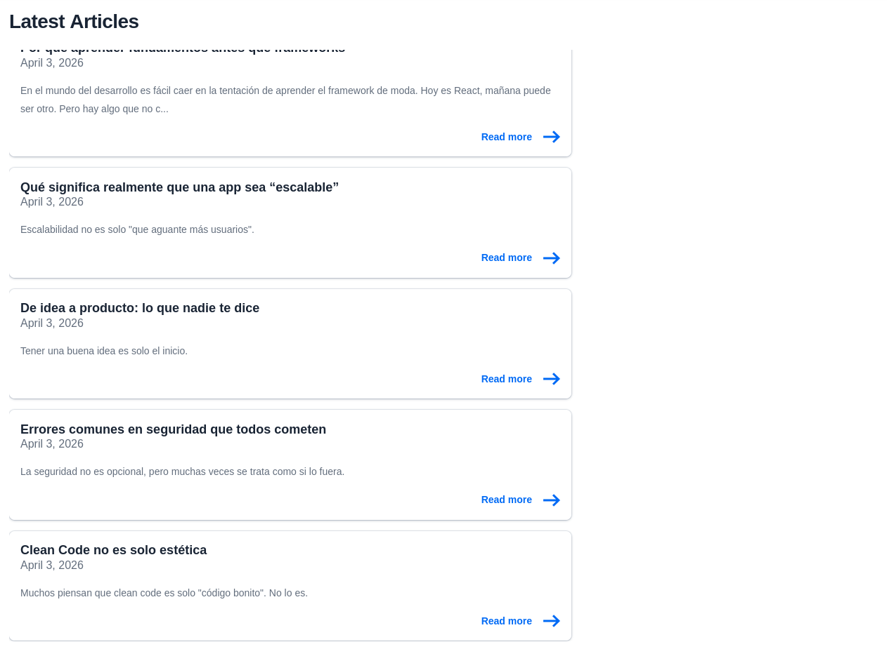
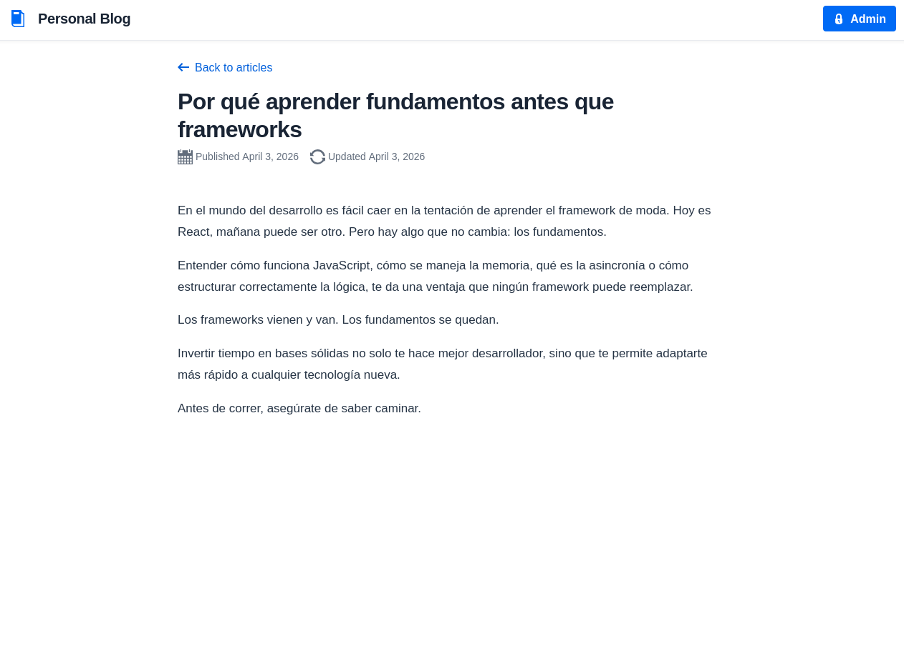
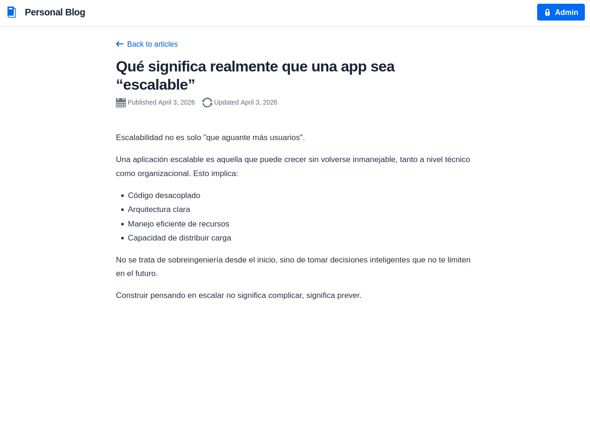
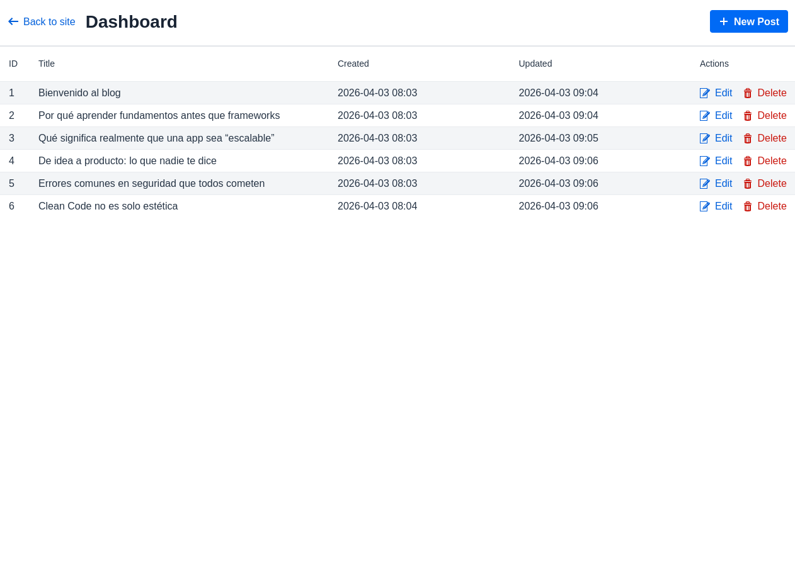
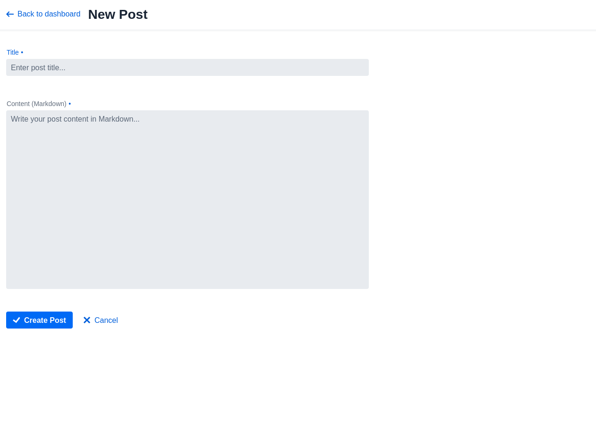
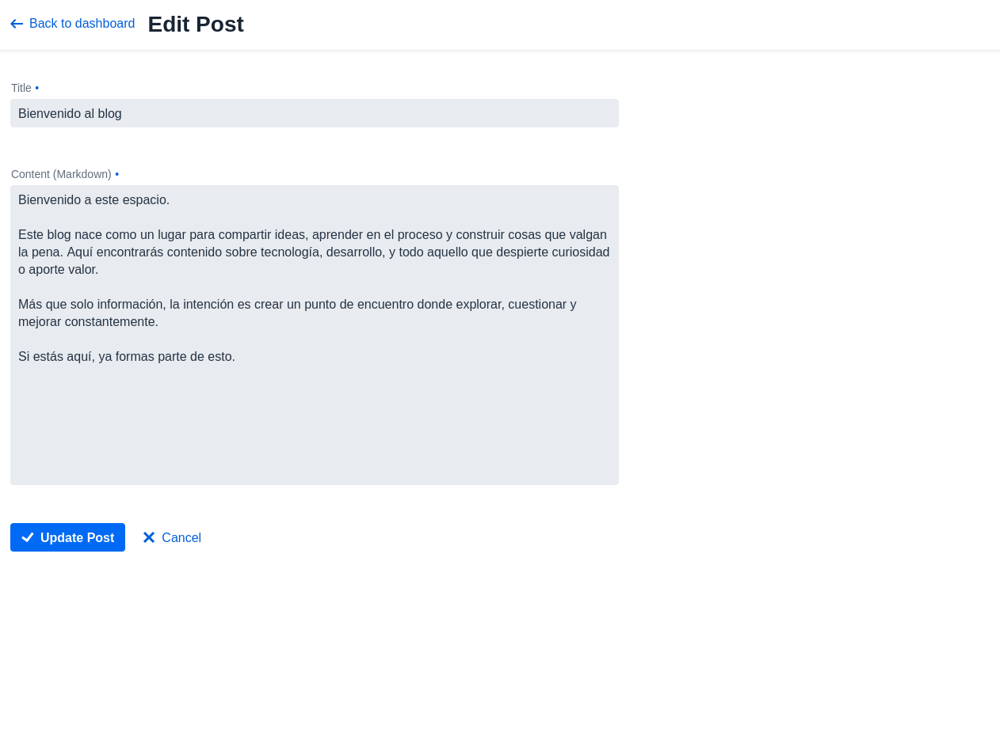
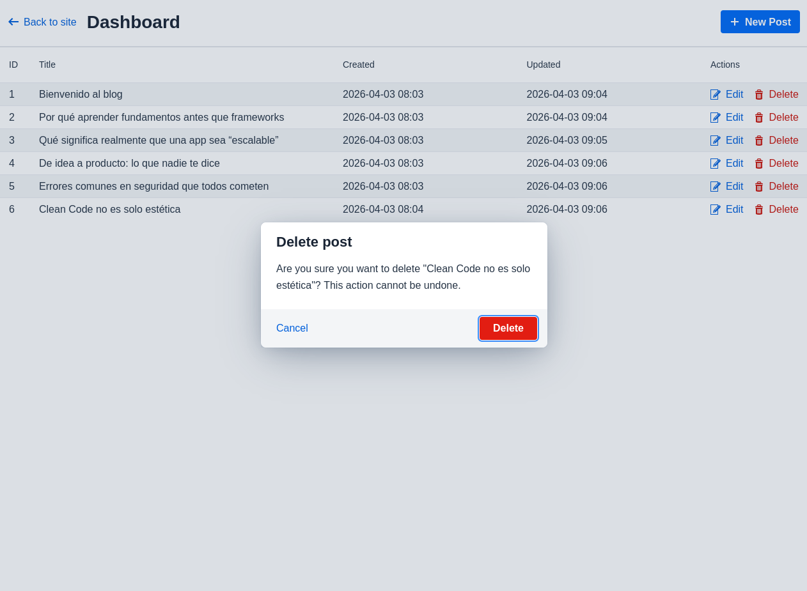

# Personal Blog Lite

A lightweight personal blog with public read access and admin panel for content management. Built with Vaadin 25, Java 21, and MariaDB.

## Features

- **Public Views**: Home page with post list, individual post detail view
- **Admin Panel**: Dashboard to manage posts (create, edit, delete)
- **HTTP Basic Auth**: Secure admin access via environment variables
- **Markdown Support**: Write posts in Markdown, rendered to HTML
- **Responsive Design**: Clean, minimal interface using Vaadin Lumo theme

## Tech Stack

| Layer | Technology |
|-------|-------------|
| Frontend | Vaadin 25.1 (Flow) |
| Backend | Java 21 |
| Database | MariaDB 11.7 |
| ORM | jOOQ 3.21 |
| Migrations | Flyway 12 |
| Server | Jetty 12 (vaadin-boot) |
| Build | Gradle (Groovy DSL) |

## Quick Start

### Prerequisites

- Docker & Docker Compose
- Java 21 (for local development)

### 1. Clone and Configure

```bash
git clone <repo-url>
cp .env.example .env
```

Edit `.env` with your credentials:

```bash
DB_ROOT_PASSWORD=your_root_password
DB_NAME=blog_lite
DB_USER=blog_user
DB_PASSWORD=your_password
ADMIN_USERNAME=admin
ADMIN_PASSWORD=your_admin_password
```

### 2. Start Database

```bash
docker compose up -d db
```

### 3. Run Application

```bash
./gradlew run
```

Open http://localhost:8080

### 4. Admin Access

Click the **Admin** button in the header or navigate to `/admin/dashboard`. You'll be prompted for HTTP Basic Auth credentials.

## Screenshots

### Home Page




### Post Detail




### Admin Dashboard



### Post Management





## Project Structure

```
src/main/java/io/vekzzdev/personal_blog_lite/
├── Main.java                    # Entry point
├── config/                      # Bootstrap, InstantiatorFactory
├── model/                       # Domain models (Post)
├── service/                     # Business logic (PostService, MarkdownService)
├── repository/                  # Repository interfaces
│   └── jooq/                    # jOOQ implementations
├── security/                    # BasicAuthFilter
├── ui/
│   ├── components/              # Reusable components (BlogHeader)
│   └── view/                    # Vaadin views
│       ├── HomeView.java        # Public: post list
│       ├── PostDetailView.java  # Public: single post
│       └── admin/               # Admin views (protected)
└── generated/jooq/             # jOOQ generated code
```

## Environment Variables

| Variable | Description | Required |
|----------|-------------|----------|
| `DB_URL` | JDBC database URL | Yes |
| `DB_USER` | Database username | Yes |
| `DB_PASSWORD` | Database password | Yes |
| `ADMIN_USERNAME` | Admin HTTP Basic Auth username | Yes |
| `ADMIN_PASSWORD` | Admin HTTP Basic Auth password | Yes |

## Docker Deployment

This project includes a complete Docker Compose setup with MariaDB and the Vaadin application.

### Prerequisites

- Docker 20.10+
- Docker Compose 2.0+

### Configuration

1. Copy the example environment file:

```bash
cp .env.example .env
```

2. Edit `.env` with your desired credentials:

```bash
# Database Configuration
DB_ROOT_PASSWORD=root_pass_2026
DB_NAME=blog_lite
DB_USER=blog_user
DB_PASSWORD=blog_pass_2026

# Admin Credentials (HTTP Basic Auth)
ADMIN_USERNAME=admin
ADMIN_PASSWORD=admin123

# Database URL (for Docker, use container name 'db')
DB_URL=jdbc:mariadb://db:3306/blog_lite

# MariaDB Version
MARIADB_VERSION=11.7
```

### Starting the Stack

Start all services (database + app):

```bash
docker compose up -d
```

This will start:
- **MariaDB** on port 3306
- **Vaadin App** on port 8080

### Checking Status

```bash
# View running containers
docker compose ps

# View logs
docker compose logs -f app
docker compose logs -f db
```

### Stopping the Stack

```bash
# Stop all services
docker compose down

# Stop and remove volumes (deletes database data)
docker compose down -v
```

### Accessing the Application

- **Public URL**: http://localhost:8080
- **Admin URL**: http://localhost:8080/admin/dashboard (requires Basic Auth)
- **Database**: localhost:3306 (if port is exposed in docker-compose.yml)

### Health Checks

The Docker setup includes health checks for both services:
- MariaDB: Uses `mysqladmin ping`
- App: Uses `curl` to check if the server responds on port 8080

### Troubleshooting

```bash
# Restart a specific service
docker compose restart app
docker compose restart db

# View detailed logs
docker compose logs app --tail=100

# Access database directly
docker compose exec db mariadb -u root -p blog_lite

# Rebuild and start
docker compose down
docker compose build --no-cache
docker compose up -d
```

## Development

This section covers local development workflows, testing, and build commands.

### Prerequisites

- Java 21 (OpenJDK or Temurin)
- Gradle 8.x (wrapper included)
- Docker & Docker Compose (for MariaDB)
- An IDE with Java 21 support (IntelliJ IDEA, VS Code with Extension Pack for Java)

### Initial Setup

1. **Clone the repository:**

```bash
git clone <repo-url>
cd personal-blog-lite
```

2. **Copy environment template:**

```bash
cp .env.example .env
```

3. **Start MariaDB:**

```bash
docker compose up -d db
```

4. **Verify database is running:**

```bash
docker compose ps
# Should show "healthy" for db service
```

### Running the Application

#### Development Mode (with hot reload)

```bash
./gradlew run
```

The app starts in development mode with:
- Vaadin Dev Tools enabled
- Live reload for frontend changes
- Debug port available (5005)

**URL:** http://localhost:8080

#### Using Gradle Tasks

```bash
# Run with custom Gradle tasks
./gradlew runDev    # Uses ADMIN_PASSWORD from env or defaults to 'dev123'
./gradlew runProd   # Requires all env vars to be set
```

### Running Tests

```bash
# Run all unit tests
./gradlew test

# Run a specific test class
./gradlew test --tests "io.vekzzdev.personal_blog_lite.service.PostServiceTest"

# Run tests with coverage report
./gradlew test
```

### Database Operations

#### Generate jOOQ Code

After schema changes, regenerate jOOQ classes:

```bash
./gradlew jooqCodegen
```

This reads the database schema and generates:
- `BlogLite.java` - catalog
- `Tables.java` - table references
- `Posts.java` - table definition
- `PostsRecord.java` - record class
- `PostsDao.java` - data access object

#### Run Migrations Manually

```bash
# Migrate (apply pending migrations)
docker compose exec app java -cp "build/classes/java/main:build/resources/main" org.flywaydb.core.Flyway migrate

# Repair (fix checksum mismatches)
docker compose exec app java -cp "build/classes/java/main:build/resources/main" org.flywaydb.core.Flyway repair

# Info (show migration status)
docker compose exec app java -cp "build/classes/java/main:build/resources/main" org.flywaydb.core.Flyway info
```

### Building for Production

#### Full Production Build

```bash
./gradlew clean build -Pvaadin.productionMode
```

This:
1. Compiles Java code
2. Generates frontend bundle (production mode)
3. Runs tests
4. Creates distribution in `build/install/`

#### Build Only (skip tests)

```bash
./gradlew build -x test -Pvaadin.productionMode
```

#### Run Production Build

```bash
# After building, run the distribution
./build/install/personal-blog-lite/bin/personal-blog-lite
```

Or with Docker:

```bash
docker compose build
docker compose up -d app
```

### Project Structure

```
personal-blog-lite/
├── src/
│   ├── main/
│   │   ├── java/io/vekzzdev/personal_blog_lite/
│   │   │   ├── Main.java                    # Entry point (Jetty launcher)
│   │   │   ├── config/
│   │   │   │   ├── Bootstrap.java            # Servlet context listener (DI setup)
│   │   │   │   └── BlogInstantiatorFactory.java  # Vaadin DI
│   │   │   ├── model/
│   │   │   │   └── Post.java                  # Domain model
│   │   │   ├── service/
│   │   │   │   ├── PostService.java          # Business logic
│   │   │   │   └── MarkdownService.java       # Markdown → HTML
│   │   │   ├── repository/
│   │   │   │   └── jooq/
│   │   │   │       └── JooqPostRepository.java  # jOOQ implementation
│   │   │   ├── security/
│   │   │   │   └── BasicAuthFilter.java       # HTTP Basic Auth
│   │   │   ├── ui/
│   │   │   │   ├── components/
│   │   │   │   │   └── BlogHeader.java        # Header with admin button
│   │   │   │   └── view/
│   │   │   │       ├── HomeView.java         # Public: post list
│   │   │   │       ├── PostDetailView.java   # Public: single post
│   │   │   │       └── admin/
│   │   │   │           ├── AdminDashboardView.java
│   │   │   │           ├── PostFormView.java
│   │   │   │           └── NewPostView.java
│   │   │   └── generated/
│   │   │       └── jooq/                     # Auto-generated (DO NOT EDIT)
│   │   └── resources/
│   │       ├── db/migration/
│   │       │   ├── V1__initial_schema.sql
│   │       │   └── V2__insert_initial_data.sql
│   │       └── logback.xml                   # Logging config
│   └── test/
│       └── java/.../service/
│           ├── PostServiceTest.java
│           └── MarkdownServiceTest.java
├── build.gradle                               # Gradle build config
├── docker-compose.yml                         # Docker Compose config
├── Dockerfile                                # Multi-stage build
├── .env.example                               # Environment template
└── README.md
```

### Common Issues

| Issue | Solution |
|-------|----------|
| `DB_URL not set` | Ensure `.env` file exists and is loaded |
| jOOQ errors | Run `./gradlew jooqCodegen` after schema changes |
| Port 8080 in use | Stop other services or change port in docker-compose.yml |
| Migration failures | Check DB credentials in `.env`, ensure MariaDB is running |
| Vaadin Dev Tools missing | Ensure NOT running with `-Pvaadin.productionMode` |

### Debugging

```bash
# Run with debug port (attach from IDE)
./gradlew run --debug

# View application logs
tail -f logs/application.log

# Check dependency tree
./gradlew dependencies

# Show build tasks
./gradlew tasks
```

## License

MIT
